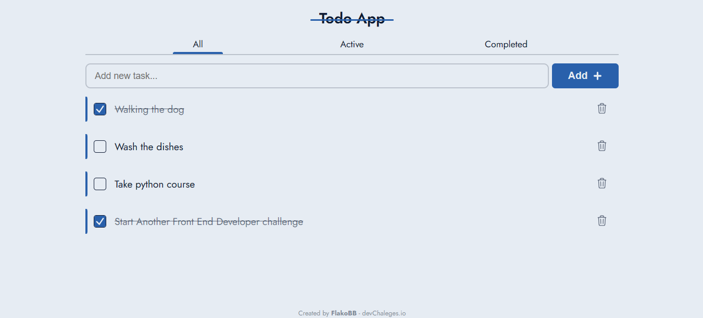

<h1 align="center">TODO APP</h1>

   Solution for a challenge from  <a href="http://devchallenges.io" target="_blank">Devchallenges.io</a>.

  <h3>
    <a href="https://todo-app-flakobb.vercel.app/">
      Demo
    </a>
     | 
    <a href="https://github.com/FlakoBB/todo-app">
      Solution
    </a>
     | 
    <a href="https://devchallenges.io/challenges/hH6PbOHBdPm6otzw2De5">
      Challenge
    </a>
  </h3>

<!-- TABLE OF CONTENTS -->

## Table of Contents

- [Overview](#overview)
  - [Built With](#built-with)
- [Features](#features)
- [Contact](#contact)

<!-- OVERVIEW -->

## Overview

My solution is a classic Todo App. I created this app using the library **React** and the framework **Next.js**.

I split the page in different components:
- Header
- MainContainer
  - Navigation Bar (Filter)
  - ListContainer
    - TaskItem
-Footer

I created two context in this app:
- **FilterContext**: Provide filter state to show the corresponding tasks.
- **TasksContext**: Share the array with the list of tasks to show.

The list of tasks is save to the browser's localStorage to guarantee the data permanence even when reloading or closing the tab.

### Built With

- [React](https://reactjs.org/)
- [Next.js](https://nextjs.org/)

## Features

This application/site was created as a submission to a [DevChallenges](https://devchallenges.io/challenges) challenge. The [challenge](https://devchallenges.io/challenges/hH6PbOHBdPm6otzw2De5) was to build an application to complete the given user stories.

## Contact

- Redes [Follow me](https://bit.ly/follow-flako)
